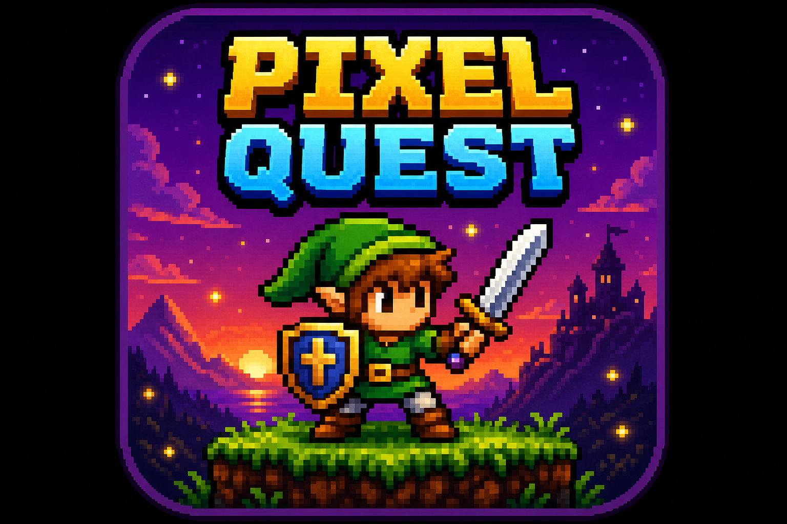
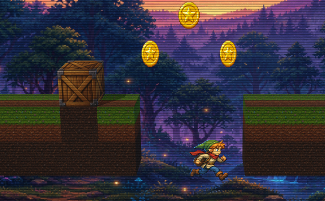
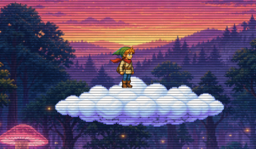

<div align="center">



# ⚔️ PIXEL QUEST ⚔️

### A retro **16-bit SNES-era** side-scrolling platformer, rendered in real **3D**.

[](https://nextjs.org/)
[](https://react.dev/)
[](https://www.typescriptlang.org/)
[](https://threejs.org/)
[](https://tailwindcss.com/)

[](https://github.com/StarKnightt/Pixel-Quest/stargazers)

**Run. Jump. Stomp. Collect. Reach the flag before the clock runs out.** 🏁

</div>

---

## 🎮 Screenshots

<div align="center">



<br/><br/>



</div>

---

## ✨ Features

- 🌲 **Real 3D world** — extruded block terrain with directional lighting + soft shadows, viewed through a tilted perspective camera, while the hand-painted hero, snails and pickups stay as crisp camera-facing **billboard sprites**.
- 🕹️ **Tight platformer physics** — hand-written gravity + axis-separated AABB tile collision, with **variable jump height**, **coyote-time** and **jump buffering** so every jump feels fair.
- 🐌 **Enemies & combat** — stomp snails from above to squash them (with a juicy squash-and-poof), or take a hit from the side and lose a life.
- 💰 **Collectibles** — spinning coins and rotating star gems. Stomping a snail awards a **random bonus** for extra spice.
- ☁️ **Moving cloud platforms** — one-way platforms that drift and carry you along.
- 💀 **Hazards** — bottomless pits and a ticking timer. Three lives, one shot at glory.
- 🎨 **Game juice** — screen shake, hit flashes, dust particles, ambient fireflies, parallax twilight backdrop and a CRT scanline post-effect.
- 🔊 **Chiptune audio** — square/triangle SFX and looping music synthesized at runtime with the Web Audio API. No audio files to download.
- 📱 **Fully responsive** — on-screen touch controls on mobile, keyboard on desktop.

---

## 🚀 Getting Started

```bash
pnpm install
pnpm dev
```

Then open **[http://localhost:3000](http://localhost:3000)** and press **START**. 🎉

> Built and run with **pnpm**.

---

## 🎯 Controls

| Action | Keys |
| :----- | :--- |
| 🏃 Move | `←` `→` &nbsp;or&nbsp; `A` `D` |
| ⬆️ Jump | `Space`, `W`, or `↑` &nbsp;*(variable height + coyote-time + jump buffering)* |
| ⏸️ Pause | `P` / `Esc` |

On touch devices, on-screen buttons appear below the game.

---

## 🧱 Tech Stack

| Layer | Tech |
| :---- | :--- |
| Framework | Next.js (App Router) + React 19 |
| Language | TypeScript |
| Rendering | Three.js (WebGL) — 3D terrain + billboard sprites |
| Styling / UI | Tailwind CSS |
| Audio | Web Audio API (runtime chiptune) |
| Physics | Custom gravity + AABB tile collision (no engine) |

---

## 🗂️ Architecture

```
app/
  layout.tsx          # retro fonts (Press Start 2P / Luckiest Guy) + metadata
  page.tsx            # renders the game
  globals.css         # CRT scanlines, pixelated scaling, retro font
  icon.png            # favicon
components/
  PixelQuest.tsx      # client component: canvas, HUD, overlays, touch controls
hooks/
  useGameLoop.ts      # fixed-timestep loop (rAF + accumulator, delta-time)
lib/game/
  constants.ts        # tuning: resolution, gravity, speeds, palette
  types.ts            # shared types
  assets.ts           # AssetLoader: preload, chroma-key, crop, bake hero frames
  audio.ts            # Web Audio chiptune SFX + looping music
  input.ts            # keyboard + virtual touch input, held-key state
  camera.ts           # smoothed horizontal-follow camera
  level.ts            # Level config + tilemap + O(1) solid-tile collision
  entities.ts         # Player, Snail, Coin, Gem, MovingPlatform + AABB resolution
  game.ts             # orchestrator: update, scoring, win/lose, particles, fx
  renderer3d.ts       # Three.js 3D renderer: terrain, lights, billboards, shadows
```

### 🔍 Rendering notes

- The simulation (physics, collision, entities, camera, audio) is fully decoupled from rendering — the same game state is drawn by the Three.js renderer.
- Hero animation frames are **baked to a shared anchor** (consistent height + centroid) so swapping frames never jitters, and the hero stands rock-solid when idle.
- **All assets are preloaded** before the first frame — no mid-loop loading, no flicker.

---

<div align="center">

### ⭐ Enjoying Pixel Quest? Drop a star — it helps a ton! ⭐

[](https://github.com/StarKnightt/Pixel-Quest)

Made with 💜 and way too much pixel art.

</div>
